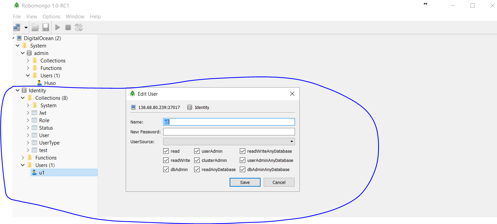

1. Mongo DB docker da oluþturulur
docker run --name mongo-server -p 27017:27017 -d mongo:2.4 --auth

2. oluþturulan mongo-server içine admin olarak baðlanýlýr
docker exec -it mongo-server mongo admin

3. Database admin user oluþturulur.
db.createUser( { user: "Huso",
          pwd: "Huso7474",
          roles: [ "userAdminAnyDatabase",
                   "dbAdminAnyDatabase",
                   "readWriteAnyDatabase"

] } )

4. Bir database oluþturulut örn. Identity ve buna bir user tanýmlanýr.
örnek user oluþturma resmi : 
